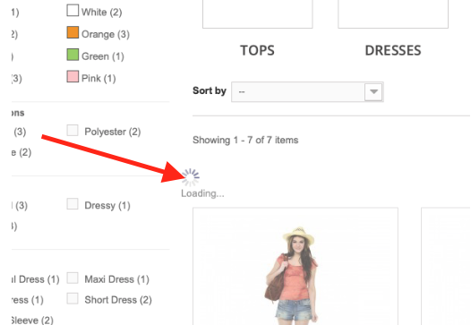
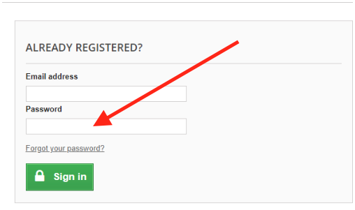
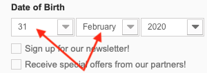
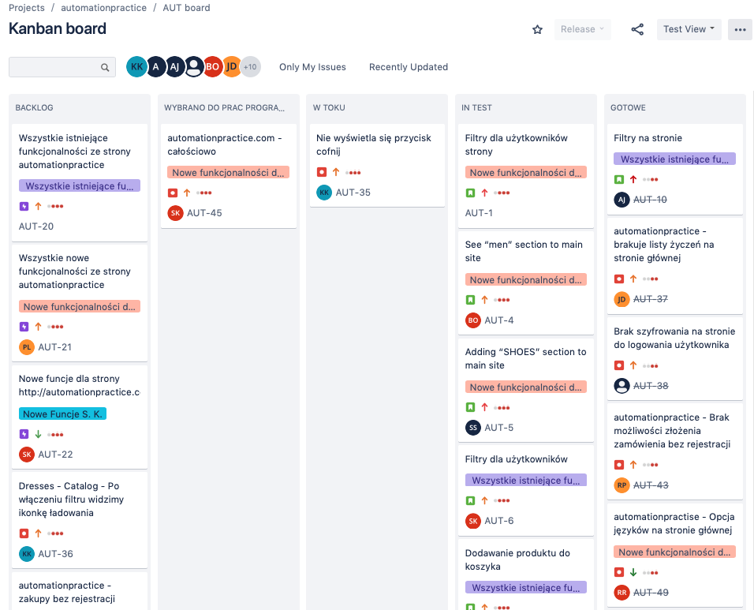

### Automation Practice 

This is a manual test of a website: http://automationpractice.com/index.php which is commonly used for finding bugs. For this task I used my macBook pro 15'' with macOS Mojave 10.14.6 operating system, inetrenet connection and Safari browser (Version 13.1.1 (14609.2.9.1.3))

First, after reviewing the website, it's present functionality I came up with some user stories both form the customer and the site owner standpiont. Here are some examples:

Example 1 - owner standpoint
> ** Title: ** adding men’s section to online store
 
> **As a seller**
> I want to add a MEN section to my online store
> So that it’s visible for the customer
> 
> **Acceptance Criteria** :
>- MEN section as a button is visible for the customer
>- seller can add products, pictures for men’s section
>- seller can add a product description up to 1000 characters. 
>- seller can save a product asa a draft (visible in Drafts tab)
>- seller can publish a product on his own board
>
> **Additional questions for the client regarding the user story:**
>
> - how will the men’s section be accessible?
> - will the men’s section have the same filter sections?
> - what kind of categories will the men’s section allow/include?
> - should T-shirt section for men be a separate section as it is now with women section?

Example 2 - user standpoint

> **Title:** different language version

> **As a user**
from Poland I want to have possibility to click change language button in visible place on 
http://automationpractice.com/index.php?fbclid=IwAR1vM_qxj7nI_P4H0kLFNQJ5n95-GMdMa63qLk73uTpAAJjOSR-pq9EZ6q0 webpage
So that it helps me to understand the content
> 
> **Acceptance Criteria :**
>
> - avaiable button to change language fot the user
> - page designer has a possibility to locate the button on the webpage
> - after clicking the button, the language on the website will change

Then I started exploratory testing and eventually found some bugs. Here are some examples I reported using Jira and Confluence:

Bug 1 - Filtering
> Steps:
> - go to Website: http://automationpractice.com/index.php
> - click WOMEN
> - click any filter in filter section f.e.: SIZE or COLOR
> - BUG: website freezes(showing “loading…”) while trying to filter garment sizes in WOMEN section. Screenshot below:

 
 
Bug 2 - Registration - Password input

> Steps :
> - go to a website : http://automationpractice.com/index.php?controller=authentication&back=my-account
> - go to registration site
> - enter e-mail address “tester1@gmail.com”
> - enter random password
> - click “ Sign In” 
> - BUG: Password form takes every password input as correct. Screenshot below:

 
 
 Bug 3 - Registration - Date of Birth
 
 > Steps:
 > - go to a website : http://automationpractice.com/index.php
 > - click "Sign in" button
 > - write any email address in the "create an account" form
 > - click "create an account"
 > - set the date of birth to 31-february 
 > - BUG: possibility to set February 31 as a date of birth. Screenshot below:
 
  
 
 Bug 4 - Form not working
 
 > Steps:
 > - go to a website : http://automationpractice.com/index.php
 > - scroll down until you see "Follow us on Facebook" form
 > - click the form and try to type anything
 > - BUG: it does not allow to type anything. Screenshot below:
 
  
  
   After finding mamny more bugs I reported them into Jira and put them into backlog.
   
   
 
