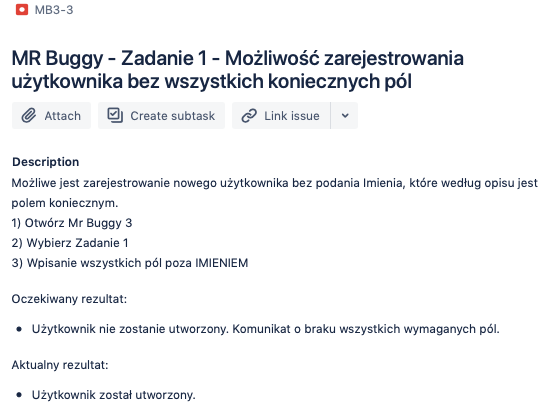
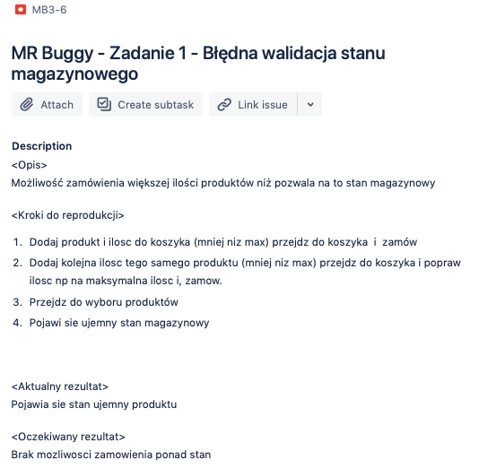
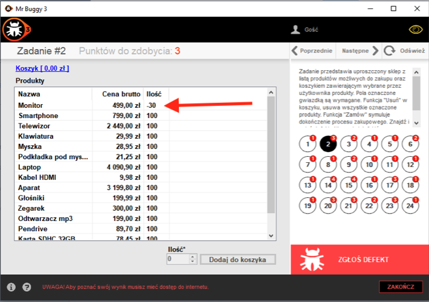
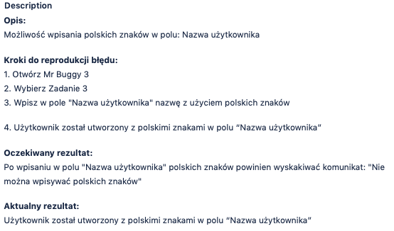
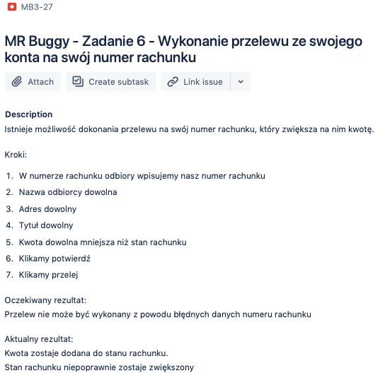
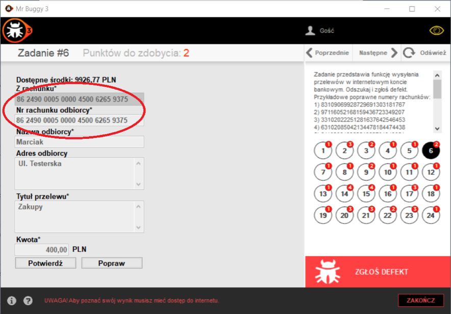
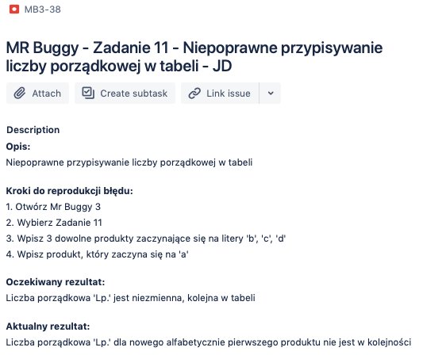
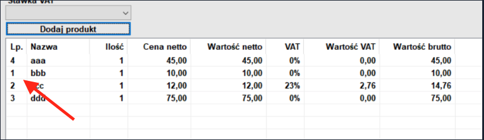

### MR Buggy 3

Mr Buggy is a family of applications and specifications shared for the purpose of testing education.

All of them served as tasks during subsequent editions of TestingCup - Championship in Software Testing. Each version of Mr Buggy has been tested by more than 500 testers. This makes them one of the best tested documents and applications ever!
Here are some examples of bugs I found:

**Task 1**

*Znajdź i zgłoś defekt w standardowej funkcji aplikacji służącej zakładaniu konta użytkownika w aplikacji internetowej. Pola oznaczone gwiazdką są wymagane. Zgodnie z wymaganiami klienta pola Imię i Nazwisko mogą przyjmować dowolne znaki. Bazuj na swojej wiedzy odnośnie tego, jak taka aplikacja powinna funkcjonować. Nie szukaj defektów użyteczności.*

**Task 2**

*Zadanie przedstawia uproszczony sklep z listą produktów możliwych do zakupu oraz koszykiem zawierającym wybrane przez użytkownika produkty. Pola oznaczone gwiazdką są wymagane. Funkcja "Usuń" w koszyku, usuwa wszystkie oznaczone produkty. Funkcja "Zamów" symuluje dokończenie procesu zakupowego. Znajdź i zgłoś defekt.  Nie szukaj defektów użyteczności.*

**Task 3**

*Znajdź i zgłoś defekt w standardowej funkcji aplikacji służącej zakładaniu konta użytkownika w aplikacji internetowej. Pola oznaczone gwiazdką są wymagane. Zgodnie z wymaganiami klienta pola Imię i Nazwisko mogą przyjmować dowolne znaki. Bazuj na swojej wiedzy odnośnie tego, jak taka aplikacja powinna funkcjonować. Nie szukaj defektów użyteczności.*

**Task 6**

*Zadanie przedstawia funkcję wysyłania przelewów w internetowym koncie bankowym. Odszukaj i zgłoś defekt. 
Przykładowe poprawne numery rachunków:
1) 83109069928729691303181767
2) 97116052168159436723349207
3) 33102022251281637642546453
4) 63102085042134478184474438
5) 61102064838251962701343051
Przykładowe niepoprawne numery rachunków:
1) 89105024841488137640364928
2) 89105024841488147640364345
3) 99103024841488147640384345
4) 99102024841488135640364345
5) 99102024846666135640364345. 
Pola oznaczone gwiazdką są wymagane. Rozłożenie pól i przycisków jest zgodne z wymaganiami klienta.*

**Task 11**

*Zadanie przedstawia funkcje tworzenia listy produktów z realnymi cenami wraz z naliczonym podatkiem VAT. Dostępne funkcje mają działać zgodnie z funkcjonalnością Windows 7 i 8. Wszystkie ceny i wartości podawane są w polskich złotych (PLN). Pola oznaczone gwiazdką są wymagane. Odszukaj i zgłoś defekt.*
 

