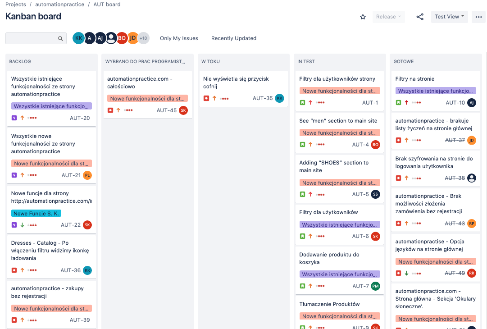

# kkowal_portfolio
<!--## sub heading-->
 This is my personal portfolio. It includes coding and testing examples. Coding includes simple exercises done in Xcode and Java. Testing includes both manual and automation  examples of the projects I did during my SDA "Software tester" course in 2020.
 
 #### Software testing
 
 #### Coding projects
 
 ##### Swift - Xcode playground
 - Investing calculator
 - Tamagotchi app
 - Temperature check
 - first time
 ##### Java
 
 
 
- first time
- second time
- third time
  - indented
    1. numbers
  
[this is the description](htttp://google.pl)

This paragraph has some `variable` inline code

```html
<p>  a paragraph example</p>
```
```java
some code
```


some paragraph with text
> blockquote text below the paragraph

| heading | header | head |
| --- | --- | --- |
| content | more content | text |
| more | more | more|

This is being * created * on a ** Friday ** ~~Saturday~~.

